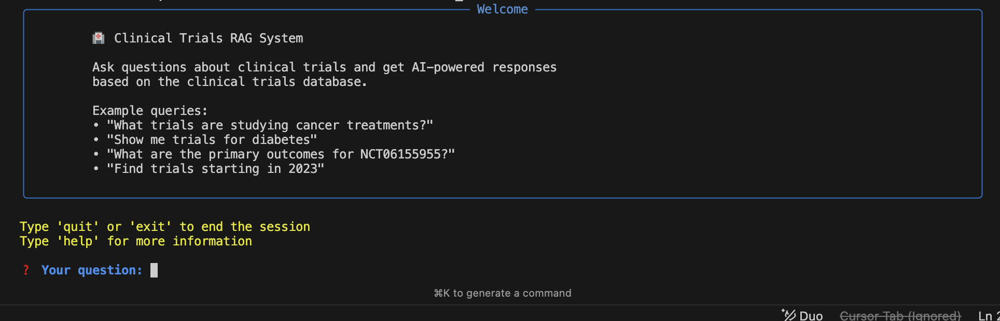
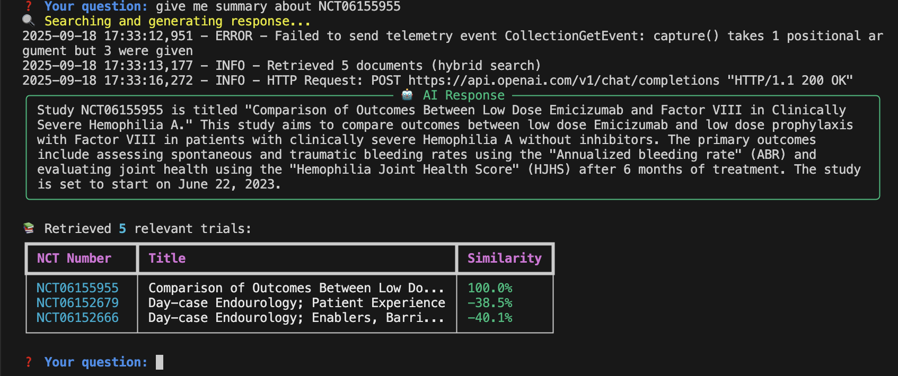
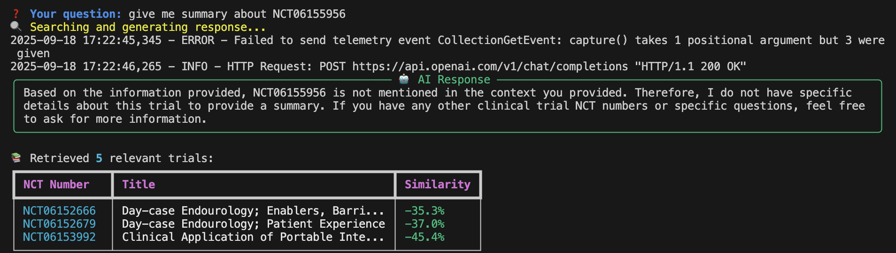
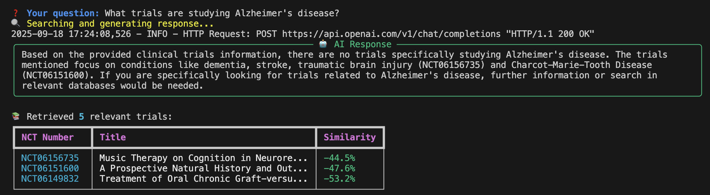
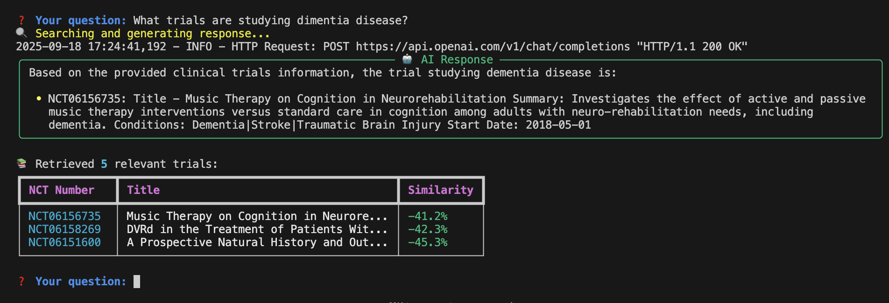

# Clinical Trials RAG System

A Retrieval-Augmented Generation (RAG) system for querying clinical trials data using AI-powered search and response generation.

## Quick Start

```bash
# 1. Install dependencies
pip install -r requirements.txt

# 2. Set up API keys
echo "VOYAGE_API_KEY=your_voyage_api_key_here" > .env
echo "OPENAI_API_KEY=your_openai_api_key_here" >> .env

# 3. Create database
python create_vector_db.py

# 4. Start using
python rag_system.py interactive
```

## API Keys Required

- **Voyage AI**: Get from [voyageai.com](https://www.voyageai.com/)
- **OpenAI**: Get from [platform.openai.com/api-keys](https://platform.openai.com/api-keys)

## Usage

### Interactive Mode
```bash
python rag_system.py interactive
```



### Single Query
```bash
python rag_system.py query "Your question here"
```

### Check Status
```bash
python rag_system.py status
```

## Accuracy Demonstration

Our RAG system provides factually accurate responses without hallucination by only using data from the vector database:

### ✅ Valid Query - Data Found
**Query:** `give me summary about NCT06155955`

*System correctly retrieves and summarizes the trial data from the database.*

### ❌ Invalid Query - No Hallucination
**Query:** `give me summary about NCT06155956` 

*System honestly reports when data is not found instead of making up information.*

### ❌ Medical Condition - No Data Available
**Query:** `What trials are studying Alzheimer's disease?`

*System correctly identifies when no relevant trials exist in the database.*

### ✅ Medical Condition - Data Found
**Query:** `What trials are studying dimentia disease?`

*System successfully finds and presents relevant trial information.*

## How It Works

1. **Query** → Analyzes your question for NCT numbers and medical terms
2. **Search** → Finds exact matches + semantically similar trials  
3. **AI Response** → Generates detailed answers using **only retrieved context**
4. **Display** → Shows results in formatted tables with sources

## Requirements

- Python 3.8+
- Internet connection
- API keys for Voyage AI and OpenAI